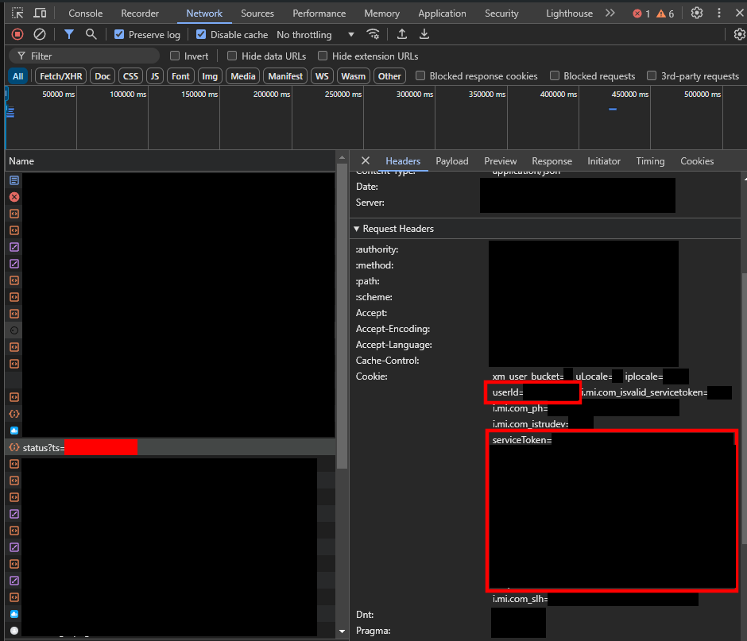

# 📜 Xiaomi notes downloader
This script allows you to download your Xiaomi notes as txt files. (private notes included)

🚧 You have to use __Xiaomi Cloud__ for this script.

## ❓ How to use?

### Browser part
* Log in to your [Xiaomi Cloud](https://eu.i.mi.com/) in a web browser
* Access the developper tool *(F12)* and go in the "**Network**" section
  * If empty, refresh the page *(F5)*
* Else, find a request that features "**Request Headers**" in the "**Header**" section
* In the "**Cookie**" header, find your "**userId**" and "**serviceToken**", and copy and paste them to ``./json/id.json``
  * *Note: in the cookie header, every element terminates by ";", select until that character not including it, do not select "userId=" nor "serviceToken="*

	

### Console part
* Make sure NodeJs is installed on your computer ``$ node -v``
* Open a command prompt, go into the folder of the repository
* Install dependencies ``$ npm i``
* Run the script ``$ node index``

**All your notes will be saved in a "notes" folder**

## 🤡 Fun fact
Masked notes are **not actually masked**, on the website, when you try to access them, Xiaomi asks you to send a code to your phone, but masked notes were loaded before you make any verification.

## 😀 Credits
* [**Maximus220**](https://github.com/Maximus220) : Developper